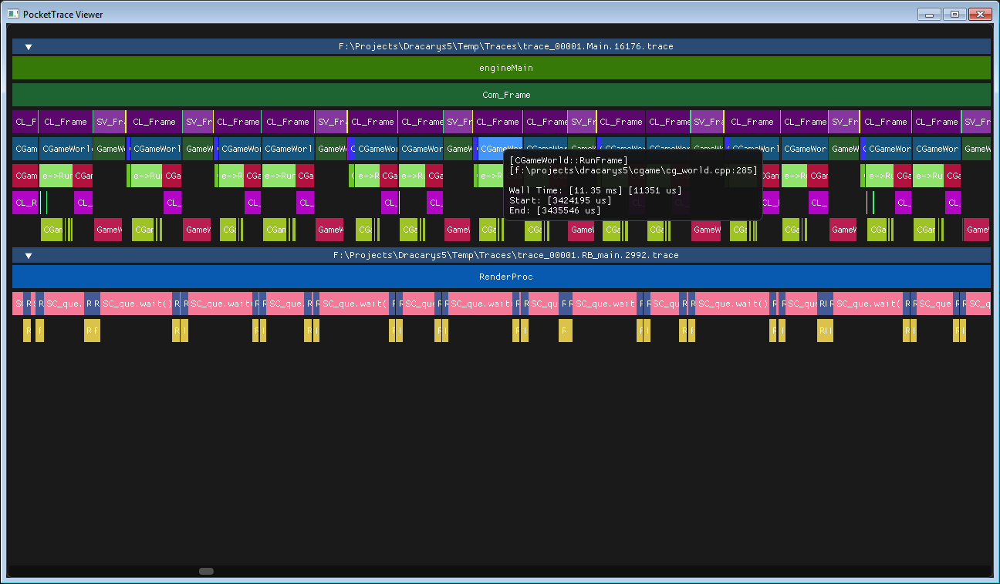

# PocketTrace Guide



PocketTrace is a self-contained intrusive profiler for C++ created by Pocketwatch Games, LLC. 
and licensed under the MIT License. A viewer is also provided and is designed to be able to view 
infinitely sized trace files consisting of millions of stack captures. Both the profiler and viewer 
are cross platform and are intended to be built from sources.

PocketTrace is under active development by Pocketwatch. We are releasing this in the hopes that it
will be useful to others but we do not make any promises that it will work for you.

PocketTrace requires a C++11 compiler or newer. The profiler and viewer are intended to be portable 
and should compile run Windows/MacOS/Linux (but may require an include for __rdtsc() on MacOS/Linux). 
Pocketwatch will be updating the profiler whenever we do our interim port to mac/linux (happens 1-2x a year).

## Profiling your code

The profiler is "instrusive" meaning it requires you to insert ```TRACE()``` macros into your code
at places you want to record timing information. You need to ```#include "TraceProfiler.h"``` in any 
files you wish to trace. Place ```TRACE()``` macros in any functions you want to capture. Make sure you 
```#define TRACE_PROFILER``` in order to turn on profiling. If ```TRACE_PROFILER``` is not defined then 
all the various ```TRACE()``` macros will be noops (useful when you ship your game). 

### 1) Add TraceProfiler.cpp to your project

The simplest way to include the profiler is by adding TraceProfiler.cpp directly to your project. If you
prefer you can build TraceProfiler.cpp as a static lib or a dll:

* If building as a lib or dll make sure to define BUILDING_TRACE_PROFILER.
* If building as a dll make sure to defined TRACE_DLL globally in your project.

SEE NOTES AT END OF README ABOUT ISSUES YOU MAY HAVE IF YOU DON'T COMPILE AS A DLL!

### 2) Initialize the profiler

Before you call anything in the profiler (TRACE() etc...) call ```TraceInit()``` and pass the native 
file path. Before your program terminates call ```TraceShutdown()```. At Pocketwatch we call ```TraceShutdown()``` 
from an ```atexit``` because it's easier to be lazy.

```c++
void TraceInit(const char* path);
void TraceShutdown();
```

The path you specify should actually be a file path _fragment_, the profiler will append the
thread id and name to this when it creates traces. Example:

```c++
TraceInit("c:\\traces\\trace_0000");
```

Would produce files like "c:\\traces\\trace_0000.main.1862.trace". 
_(note trace files can easily be 100s of megabytes so you may want to have your program periodically prune
old traces)_

The trace profiler consists of two files, TraceProfiler.h and TraceProfiler.cpp. These are intended
to be included in your project, either directly or compiled as a library or dll (depending on your
projects needs). For the simplest projects simply including those two files should be sufficient.

### 3) Place macros in your code

The profiler supports multi-threaded applications. Somewhere at the root of your thread (including
your main thread) you need to place the ```TRTHREADPROC()``` macro like so:

```c++
#include <cstdlib.h>
#include <thread>
#include "TraceProfiler.h"

static void SomeOtherThread() {
	TRTHREADPROC("SomeOtherThread");
	TRACE();
}

int main(int argc, const char** argv) {
#ifdef TRACE_PROFILER
	atexit(TraceShutdown);
	TraceInit("c:\\traces\\trace");
#endif

	// Make profiler aware of this thread.
	TRTHREADPROC("main");
	// Push "main" function into trace
	TRACE();

	std::thread thread(SomeOtherThread);

	// Call into application with other code that has TRACE()
	while (ApplicationTick()) {}

	thread.join();

	return 0;
}
```

### 4) OTHER MACROs

```c++
TRBLOCK(_label)

void Foo() {
	TRACE();
	{
		TRBLOCK("some stuff ");
		... Do things
	}
	{
		TRBLOCK("some other stuff");
		...
	}
}
```

```TRBLOCK()``` lets you time individual scoped blocks inside a function.

```c++
TRLABEL(_label)

void Foo() {
	TRACE();
	
	TRLABEL("some stuff ");
	... Do things

	TRLABEL("some other stuff");
	... Do other things
}
```

```TRLABEL()``` lets you time individual sections of a function that aren't inside
a block. It does this be popping off an existing block or label and pushing a new one.

### 5) Notes on building as a lib or directly including TraceProfiler.cpp in your project.

_This section only concerns you if your project consists of multiple DLLs that you wish to trace AND
you don't want to build TraceProfiler.cpp into a DLL and link against that._ 

You will need to be aware of the ```extern TRACE_API THREAD_LOCAL TraceThread_t* __tr_thread;``` variable 
and manually sync it across the DLL boundary. You should statically link the TraceProfiler.cpp into your
main application, and manually sync the ```__tr_thread``` variable across DLL calls. Do NOT link the DLLs against
the profiler code (they can include the header just fine).

You will have to provide your DLLs with hooks back into your main application to call the trace functions like in
this example:

```c++
#ifdef TRACE_PROFILER
#if defined(TRACE_INLINE)
inline TraceThread_t* TraceThreadGrow() {
	auto thread = IApplicationCallbacks->TraceThreadGrow();
#ifndef TRACE_DLL
	__tr_thread = thread;
#endif
	return thread;
}
#endif

inline void TraceBeginThread(const char* name, uint32_t id) {
	IApplicationCallbacks->TraceBeginThread(name, id);
}

inline void TraceEndThread() {
	IApplicationCallbacks->TraceEndThread();
}

inline void __TracePush(trace_crcstr_t label, trace_crcstr_t location) {
	IApplicationCallbacks->TracePush(label, location);
}

inline void __TracePop() {
	IApplicationCallbacks->TracePop();
}

#endif
#endif
```

## Using the viewer

Drag and drop trace files into the viewer window to open them.

## Building the viewer

A premake5 project is provided and should work on windows (and MacOS/Linux with some changes probably). The
viewer is built using SDL2, IMGUI, MIO and should be fully cross platform.
